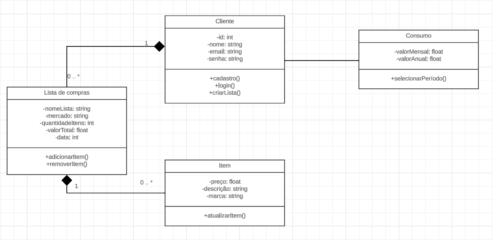
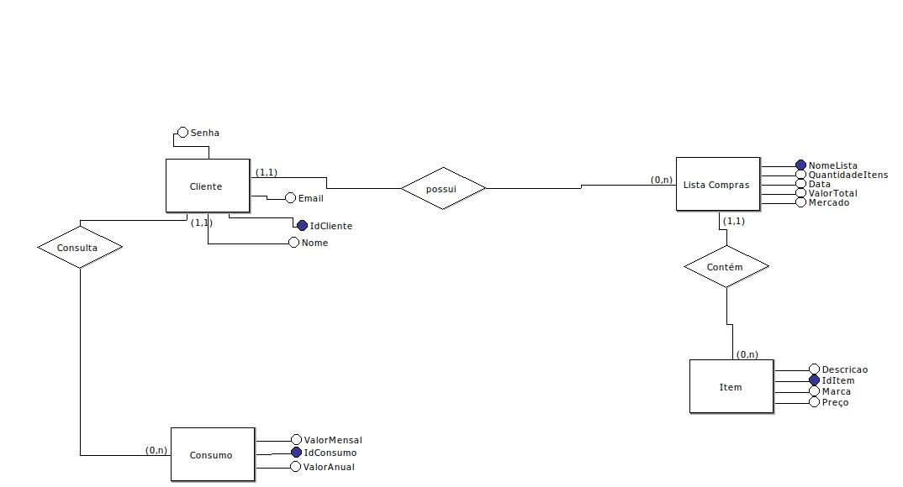
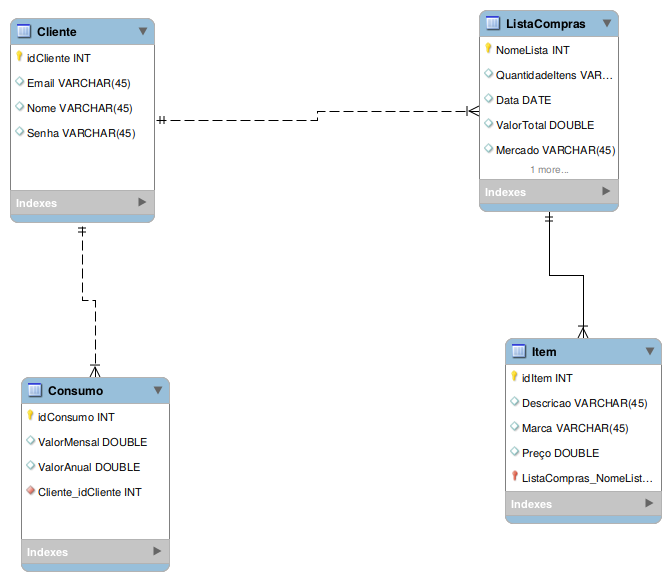

# Arquitetura da Solução

Pré-requisitos: <a href="3-Projeto de Interface.md"> Projeto de Interface</a>

Definição de como o software é estruturado em termos dos componentes que fazem parte da solução e do ambiente de hospedagem da aplicação.

## Diagrama de Classes

O diagrama de classes ilustra graficamente como será a estrutura do software, e como cada uma das classes da sua estrutura estarão interligadas. Essas classes servem de modelo para materializar os objetos que executarão na memória.

## Modelo ER

O Modelo ER representa através de um diagrama como as entidades (coisas, objetos) se relacionam entre si na aplicação interativa.

## Esquema Relacional

O Esquema Relacional corresponde à representação dos dados em tabelas juntamente com as restrições de integridade e chave primária.
 

## Modelo Físico
O arquivo está dentro da pasta src\bd.

## Tecnologias Utilizadas

|Função    | Tecnologia  | 
|------------|-----------------------------------------|
| Linguagem | JavaScript | 
| Framework | ReactNative |
| Liguagem | C# |
| Bibliotecas | React Native Paper, React Navigation, Json server, Json server auth, Axios | 
| IDE | Visual Studio Code | Visual Studio |
| Ferramentas | Microsoft Teams, GitHub, Whatsapp | 
| Banco de dados | noSQL | Firebase
| Banco de dados | SQL |

## Hospedagem

A princípio, utilizaremos o Microsoft Azure para hospedagens.

## Qualidade de Software

Conceituar qualidade de fato é uma tarefa complexa, mas ela pode ser vista como um método gerencial que através de procedimentos disseminados por toda a organização, busca garantir um produto final que satisfaça às expectativas dos stakeholders.

No contexto de desenvolvimento de software, qualidade pode ser entendida como um conjunto de características a serem satisfeitas, de modo que o produto de software atenda às necessidades de seus usuários. Entretanto, tal nível de satisfação nem sempre é alcançado de forma espontânea, devendo ser continuamente construído. Assim, a qualidade do produto depende fortemente do seu respectivo processo de desenvolvimento.

A norma internacional ISO/IEC 25010, que é uma atualização da ISO/IEC 9126, define oito características e 30 subcaracterísticas de qualidade para produtos de software.
Com base nessas características e nas respectivas sub-características, utilizararemos como base para nortear o desenvolvimento do projeto de software as que se seguem abaixo, juntamente com suas respectivas métricas:

### Eficiência de performance:

Comportamento do tempo: tempo de resposta e processamento adequado? Sim e Não

### Compatibilidade:

Coexistência: capacidade de realizar funções eficientemente enquanto compartilha um ambiente ou recursos com outros produtos? Sim e Não

### Usabilidade:

Adequação reconhecível: capacidade de reconhecer se um produto ou sistema é apropriado para suas necessidades? Sim e Não

Capacidade de aprendizado: facilidade de aprender como utilizar o produto ou sistema? Sim e Não

Estética da interface de usuário: agradabilidade da interface? Sim e Não

### Confiabilidade

Disponibilidade: se um sistema, produto ou componente está acessível e operante? Sim e Não

### Segurança

Confidencialidade – produto ou sistema é capaz de garantir que dados são acessados apenas por aqueles que têm acesso autorizado? Sim e Não

Integridade – capacidade de prevenir acesso não-autorizado e modificação de dados ou programas de computador? Sim e Não

### Manutenibilidade

Analisabilidade: capacidade de diagnosticar problemas ou causas de falhas, assim como partes a serem modificadas? Sim e Não

Modificabilidade: capacidade de um produto ou sistema ser modificado sem introduzir defeitos ou diminuir a qualidade atual? Sim e Não

Testabilidade: efetividade de testes para o sistema, produto ou componente? Sim e Não

### Portabilidade

Adaptabilidade: capacidade de um produto ou sistema de ser adaptado a um novo hardware, software ou outros ambientes? Sim e Não

