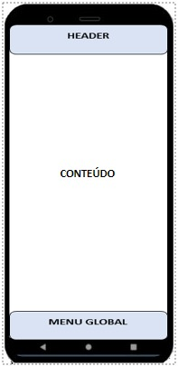
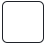
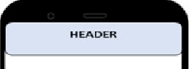
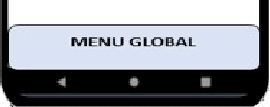

# Template Padrão da Aplicação

Layout padrão da aplicação que será utilizado em todas as páginas com a definição de identidade visual, aspectos de responsividade e iconografia, a estrutura do site é mostrada a seguir:




O template do site é composto pelos seguintes layouts:

- Header
- Conteúdo
- Menu Global

Além dos layouts, o site também possui uma paleta de cores bem definida:

 Blue, seu hexadecimal é:
```
#f0f8ff
```

 white, seu hexadecimal é:

```
#ffffff
```

Os arquivos que contém os layouts são:

- login.js
- home.js
- cadastroProduto.js
- perfil.js

## Header

Elemento que aparece no topo de todas as páginas.



## Menu Global

Elemento que aparece no final de todas as páginas.


